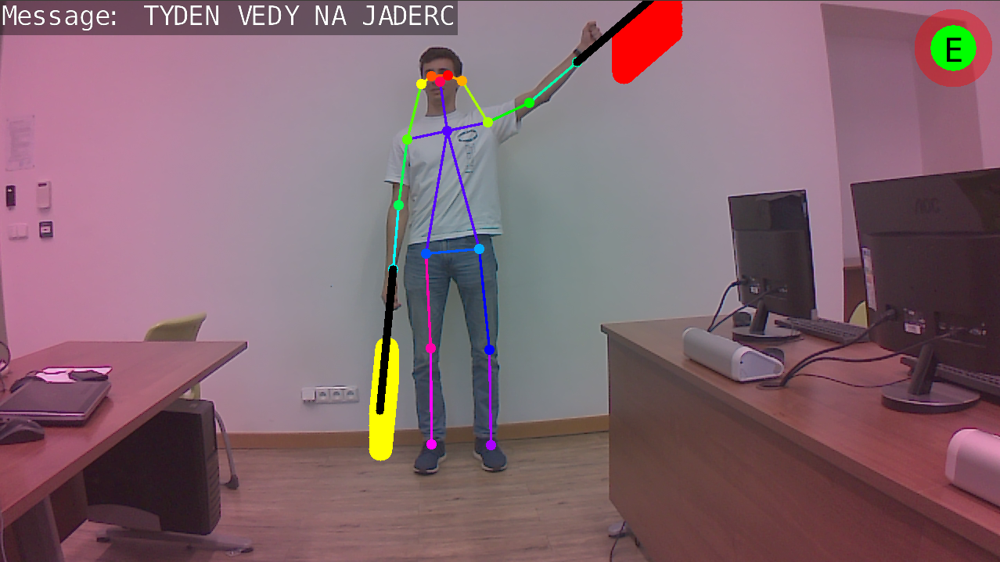

# Autoři
Tadeáš Těhan, Gymnázium Ostrava-Zábřeh; tadeastehan@gmail.com

Mikuláš Voňka, Gymnázium Kladno; vonka.mikulas@seznam.cz

Jan Pavel Šafrata, Gymnázium Evolution; honza@klan.cz

# Abstrakt
V posledních letech zažívá oblast umělé inteligence a strojového učení dramatický nárůst zájmu a inovací. Tento rozmach otevírá nové možnosti v různých oborech, včetně počítačového vidění. V našem projektu jsme se zaměřili na použití zařízení NVIDIA Jetson Nano, které je vybaveno výkonnou grafickou kartou optimalizovanou pro aplikace umělé inteligence a počítačového vidění. Cílem naší práce bylo rozpoznat pomocí Jetson Nano znaky vlajkového semaforu[^1] na základě klíčových bodů na těle. Po rozpoznání jednotlivých písmen jsme byli schopni dekódovat vysílanou zprávu. Z našich experimentů jsme získali cenné poznatky a diskutovali jsme o praktických výhodách a omezeních tohoto zařízení.

# Úvod

Zařízení, na kterém jsme celý projekt testovali, byl malý jednodeskový
počítač NVIDIA Jetson Nano s GPU[^2]. Díky tomu aspektu je náš
projekt přenosný a díky akceleraci výpočtů pomocí GPU i dostatečně
rychlým. Pro urychlení výpočtů jsme využili technologii CUDA od
společnosti NVIDIA, která umožňuje efektivní zpracování paralelních
úloh. NVIDIA rovněž poskytuje Software Development Kit pro
hluboké učení, což nám značně usnadnilo vývoj aplikace. Na základě
našich experimentů jsme analyzovali výsledky a podrobně diskutovali
výhody a omezení tohoto zařízení pro praktické použití.

Pro rozpoznávání důležitých bodů na těle jsme použili již předtrénovaný
model *Pose-ResNet18-Body*, který dokáže identifikovat 18 klíčových bodů
na lidském těle, viz obrázek níže. Tento model nám umožnil sledovat pozice
rukou a efektivně tak rozpoznávat jednotlivé signály semaforu vlajek. Celý systém jsme vytvářeli pomocí programovacího
jazyku Python, který nabízí specializovanou knihovnu pro práci s tímto
zařízením.

  

# Implementace kódu

Naším prvním úkolem bylo umožnit programu rozpoznat gesta. To zahrnovalo
identifikaci, kdy jsou paže v rovném postavení, což naznačuje pokus o
gesto. Prozkoumali jsme různé metody, jak definovat tuto podmínku, a
nakonec jsme našli optimální řešení. Vypočítali jsme rozdíly v
souřadnicích $x$ a $y$ mezi body ramene a loktu, stejně jako mezi loktem
a zápěstím pro obě paže. Tyto rozdíly nám poskytly vektory různých
délek. Když bylo gesto prováděno, tyto vektory byly zarovnány ve stejném
směru. Tím, že jsme vektory škálovali tak, aby jejich souřadnice $x$
odpovídaly, jsme zajistili, že pokud by vektory směřovaly stejným
směrem, jejich souřadnice $y$ by byly stejné. Poté jsme měřili rozdíl
mezi souřadnicemi $y$ dvou vektorů, který by měl být blízko nule, pokud
by bylo gesto prováděno.

Následně jsme potřebovali určit úhly, které paže svírají s vertikální
osou. Toho jsme dosáhli výpočtem rozdílů v souřadnicích $x$ a $y$ mezi
body ramene a zápěstí a následným použitím dvouargumentové funkce
*atan2* k nalezení úhlu paže vzhledem k vertikální ose. Poté jsme
přiřadili hodnoty úhlů pro obě paže ke každému znaku abecedy semaforu
vlajek.

Dále jsme vyvinuli podmínku pro přesné detekování písmene, které se
osoba snažila signalizovat. Vzhledem k tomu, že spolehnutí se na jediný
snímek by mohlo vést k chybám, implementovali jsme robustnější přístup.
Definovali jsme proměnnou $i = 0$ a referenční proměnnou $r$ jako
písmeno z prvního snímku. Dále se v algoritmu mění hodnota $r$ pouze v
případě, kdy se $i$ rovná nule. Následná písmena z po sobě jdoucích
obrázků byla porovnána s hodnotou $r$. Pokud se shodovala, zvýšili jsme
$i$ o 1; pokud se lišila, snížili jsme $i$ o 1. Když $i$ dosáhne
předdefinovaného prahu $2.5 \times f$, kde $f$ představuje počet snímků
videa za sekundu, což se stane po 2.5 sekundách signalizace stejného
písmene, program potvrdí písmeno a vytiskne ho. Po dosažení tohoto prahu
je proměnná $i$ vynulována, referenční proměnná $r$ se změní na aktuální
písmeno a začne detekce dalšího písmene zprávy.

## Grafické prostředí

Součástí grafického prostředí, které je zobrazeno na obrázku níže, je v levém
horním rohu červený kruh, který se postupně v závislosti na proměnné $i$
naplňuje zelenou barvou. Pokud jsme tedy v postavení dostatečně dlouho
dobu, tak se kruh naplní zelenou barvou a písmeno se přidá do zprávy v
levém horním rohu. Ve středu tohoto kruhu se nám také zobrazuje
konkretní písmeno, které program detekuje. Součástí znaků vlajkového
semaforu je i mezera či znak, díky kterému můžeme písmena mazat
(backspace). V grafickém prostředí vidíme také kostru rozpoznaných bodů
na lidském těle, které drží virtuální vlajky pro lepší imitaci reality.

# Výsledky a diskuse

Námi vytvořený program dokáže úspěšně detekovat většinu znaků vlajkového
semaforu. Jedno významné omezení nastalo, když byla paže umístěna přímo
nad hlavou. Použitá neuronová síť má v této pozici potíže s
rozpoznáváním klíčových bodů na paži. Abychom to vyřešili, upravili jsme
podmínku detekce gest tak, aby se neaktivovala v určitých úhlech nad
hlavou.

Další problém nastal, když paže překřížila tělo a ukazovala na opačnou
stranu. Toto umístění někdy způsobilo, že program nesprávně
identifikoval klíčové body na paži, což vedlo k chybnému rozpoznání
určitých písmen. Implementovali jsme další korekční opatření pro zvýšení
přesnosti, ale stále je zde prostor pro zlepšení.

Tato omezení zdůraznila složitost rozpoznávání gest a potřebu neustálého
zdokonalování. Budoucí práce by mohla zahrnovat vylepšení algoritmu pro
lepší zvládání extrémních poloh paží a zkoumání pokročilejších modelů
strojového učení. Ke zlepšení přesnosti by mohlo vést natrénování
vlastní neuronové sítě přímo pro tyto účely.

# Závěr

V tomto projektu jsme vyvinuli systém pro rozpoznávání znaků vlajkového
semaforu pomocí počítače Jetson Nano. Během vývojového procesu jsme
narazili na několik výzev, které vyžadovaly inovativní řešení a úpravy
našeho původního návrhu.

Celkově projekt úspěšně demonstroval potenciál využití počítačového
vidění a strojového učení pro rozpoznávání gest a znakových jazyků.
Navzdory výzvám systém ukázal slibné výsledky a s dalším vylepšením má
potenciál stát se spolehlivým nástrojem pro usnadnění neverbální
komunikace.

# Poděkování

Naše hlavní poděkování si zaslouží Ing. Jakub Klinkovský, Ph.D. za
odbornou pomoc při zhotovení práce.

[^1]: Anglicky: *flag semophore*
[^2]: Graphics processing unit
